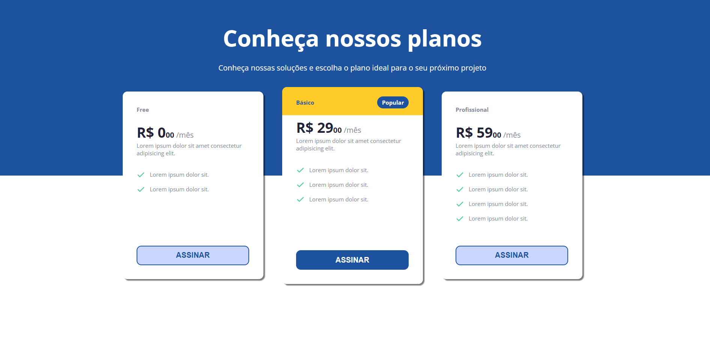

<h1 align="center"> Pricing Table </h1>

Página com uma tabela com opções de preços/planos de um produto/serviço

  <a href="#-tecnologias">Tecnologias</a>&nbsp;&nbsp;&nbsp;|&nbsp;&nbsp;&nbsp;
  <a href="#-projeto">Projeto</a>&nbsp;&nbsp;&nbsp;|&nbsp;&nbsp;&nbsp;
  <a href="#-layout">Layout</a>

 

  

 

## 🚀 Tecnologias

Esse projeto foi desenvolvido com as seguintes tecnologias:

- HTML e CSS
- JavaScript

 

## 💻 Projeto

O projeto tem como objetivo a criação de uma página com uma tavela de opções de preços/planos de um produto/serviço.
Utilizei o JavaScript para preencher cada caixa de opção de forma mais limpa.
Você pode ver o projeto [clicando aqui](https://paulaandrezza.github.io/Pricing-Table).

 

## 🔖 Layout

Você pode visualizar o layout do projeto através [DESSE LINK](https://www.figma.com/file/sSq019RDznSm3eyZoo3OHc/DD-Pricing-Table/duplicate). É necessário ter conta no [Figma](https://figma.com) para acessá-lo.
